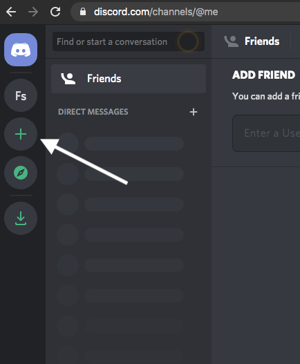

# Nural-Networks-based-AI-chatbot-for-discord

This is a basic neural network chatbot that can be implemented in a discord server. 

The main_app.py is written compatible with Google colabs, so you dont have to run it with a compiler if you don't have installed on your computer. 
Follow these steps if you simply want to run in google colabs environment:

# 1- Start a new google colab environment: 

Here is a [link](https://https://colab.research.google.com/) to start a google colab environment


# 2- Install necessary libraries:

Tflearn library: TensorFlow deep learning lIbrary is a modular and transparent deep learning library built on top of Tensorflow. It was designed to provide a higher-level API to TensorFlow in order to facilitate and speed-up experimentations, while remaining fully transparent and compatible with it. Tflearn is right now not pre-installed in google colabs. 

Here is how you install tflearn in google colabs environment. 

```
pip install tflearn
```
More information on tflearn can be found [here](http://tflearn.org/).

discord library: An easy to use, feature-rich, and async ready API wrapper for Discord written in Python. It installed the same way as tflearn:

```
pip install discord
```


# 3- Download the files:  
Download main_app.py , discord_connect.py, and intents.json files and add them to your google colab directory. Make sure to connect your google drive and save the files in a right folder, everytime you close google colab envirnment, you will lose your files unless you have them in your google drive folder. 

File intents.json loads basic intents to train the AI chatbot, right now it is trained on 1000 epochs. Yyou can add your own patterns and responses and play with the number of epochs for different accuracy. 


## 4- Create a discord server and add a bot: 

If you don't have a discord account follow this [link](https://discord.com). Creating a discord account is pretty straight forward. Once you have your account set up, on the left side click on the ' + ' sign to start a new server as shown in image below: 





then choose '*create my own*', then choose '*for me and my family*' and finally give a name for your server. 

Then create a Discord developer portal follow this [link](https://discord.com/developers/applications) then click on New Application as shown in image below:
